# Zuru X-Shot Insanity Replacement Parts

The Zuru X-Shot Insanity is an 8-shot toy dart blaster (an off brand Nerf blaster). It is relatively inexpensive and effective - until it breaks, and it always does, because it has at least 3 common failure modes. This replacement part solves the worst of them.

The 3 failures are:
1. The spring-loaded air chamber is made of very thin plastic. After being pulled back enough times, it inevitably cracks. Once it does, no air is pushed through the chamber. If the blaster will lock, spin the revolver, and fire, but the dart does not come out, this is the most likely issue.
2. The locking mechanism is pulled back by a plastic part with a metal pin. The thin plastic part can pull apart against the metal.
3. On the inside of that mechanism, the metal pin attaches to a metal nut that is embedded in plastic. The plastic eventually pulls apart, releasing the nut.

[This part](zuru_replacement_final.stl) fixes problem 1.

The blaster comes with at least 2 of those cheap plastic parts. If one breaks, you at least get a second chance. [This part](cocking_mechanism_final.stl) replaces the outside of the cocking mechanism and fixes problem 2.

If the inside mechanism breaks, you can usually get away with sticking the pin in the other side.

## Problem 1
This part, defined in [zuru_replacement.py](zuru_replacement.py), with output in [zuru_replacement_final.stl](zuru_replacement_final.stl) replaces the original part that breaks. I printed it on an Elegoo Mars 5 Ultra in ABS v3.0 resin.

## How to install

Before you start, remove the pin. The blaster will look like this: 
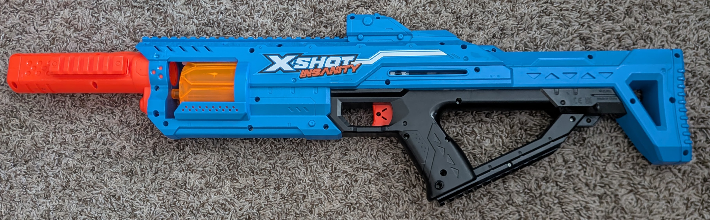

Remove all 19(!) screws.

The inside will look something like this:
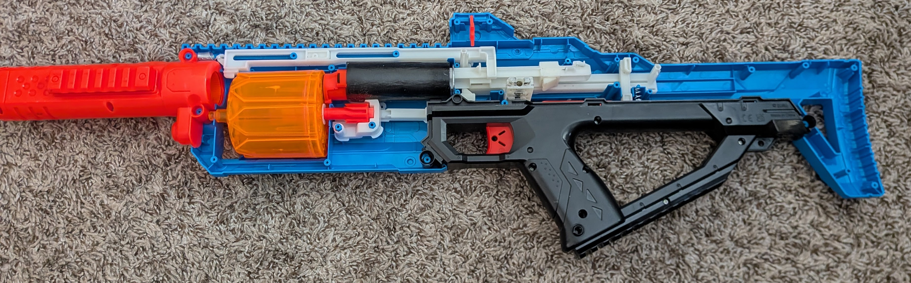

Note that about half of them that I've taken apart have a  broken  part where either the place that holds it in place is cracked or the spring is bent and twisted. I have found that this part is not absolutely necessary to the mechanism working, so if it is broken, you don't need to put it back. I'm also showing what it looks like correctly seated.
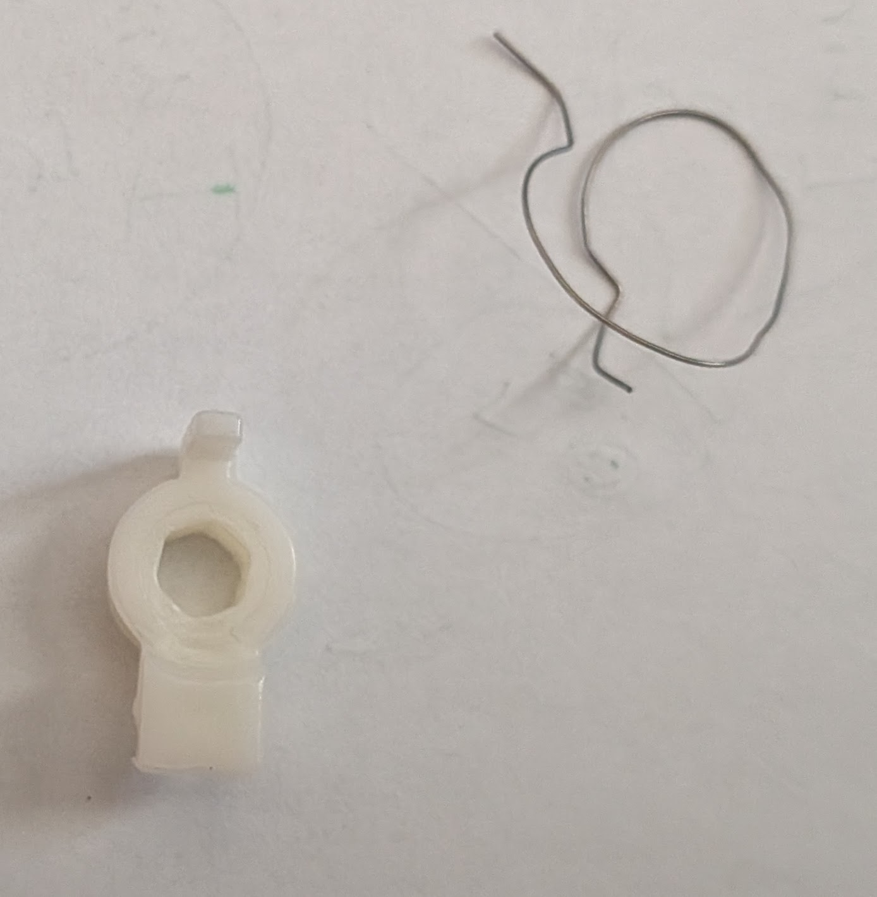
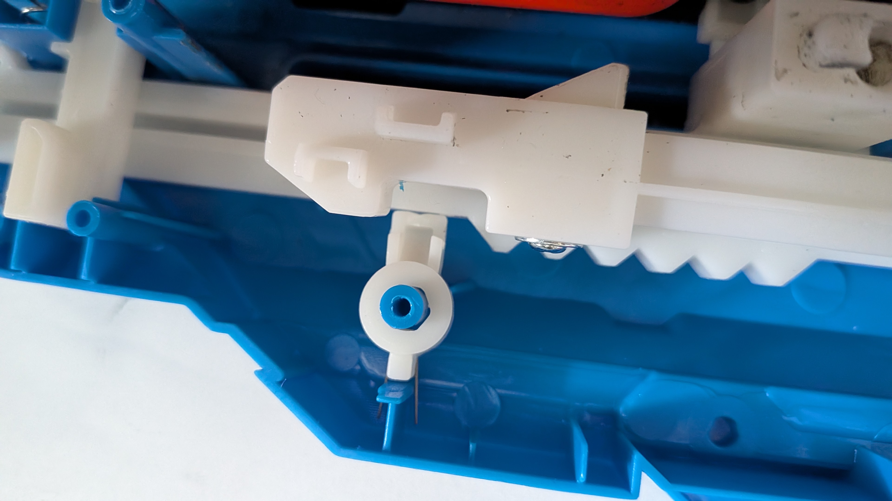

Now you have to remove the air chamber and the plastic arm that sticks into it with the broken orange piece attached
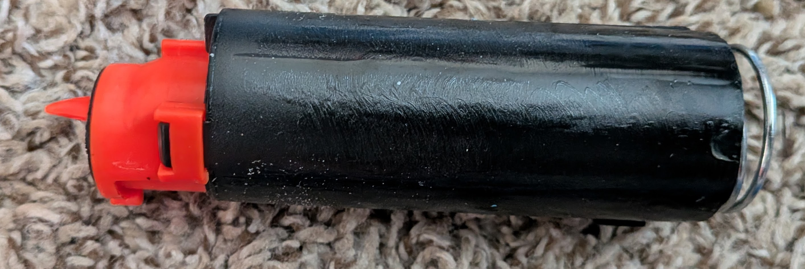
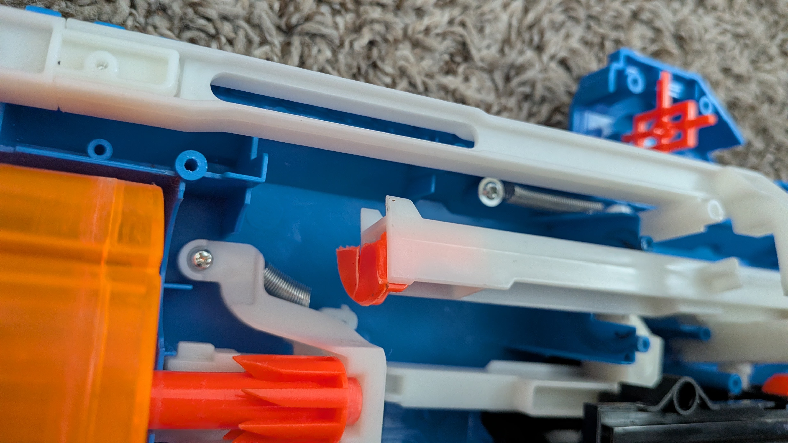

Unscrew the broken piece and keep the screw.
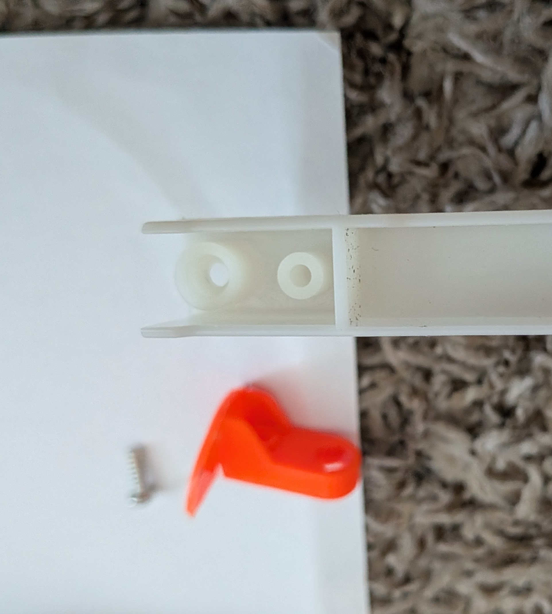

Place the new piece in place of the old one, push it in all the way.
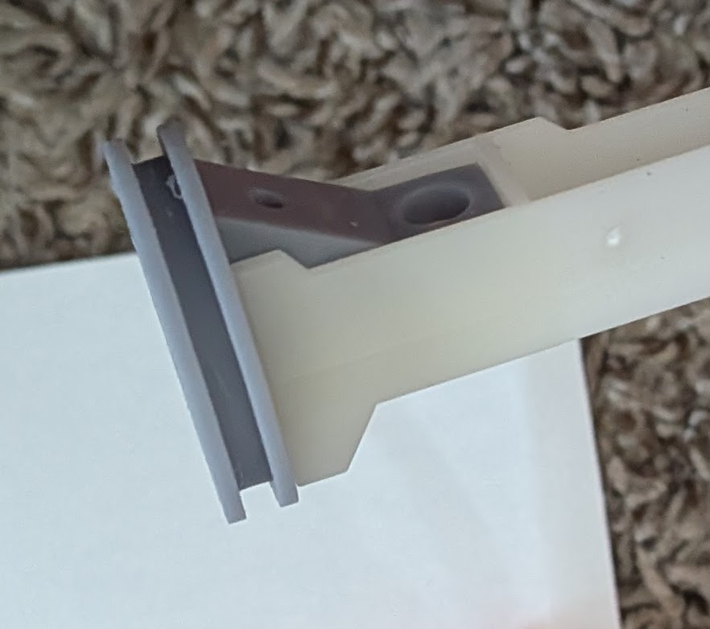
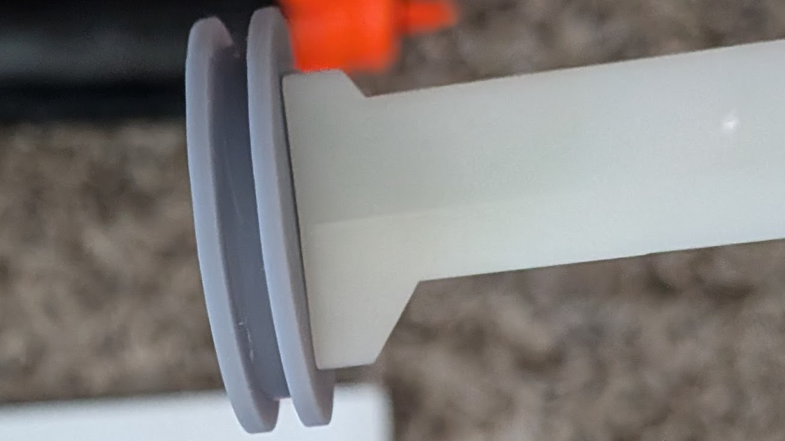

Remove the spring and the broken plastic parts from the air chamber.
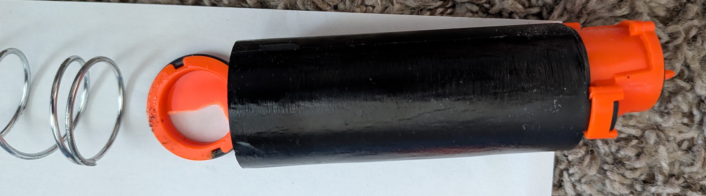

Take the rubber o-ring off the broken plastic piece and place it on the new piece.
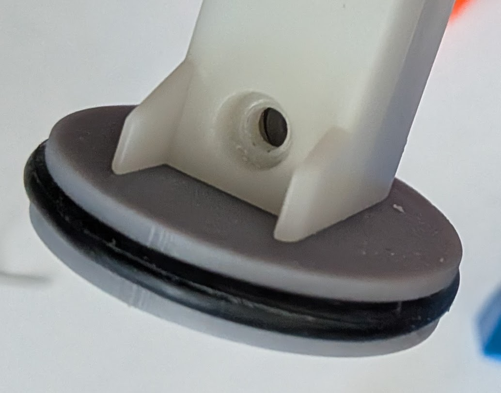

Screw it in place. Note that the 3D printed part is not tapped. The screw will tap itself.
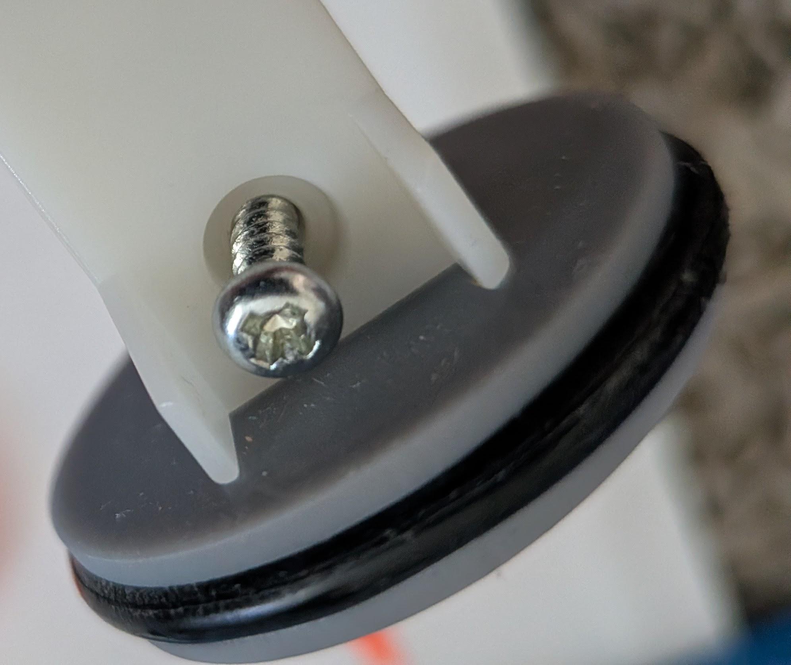
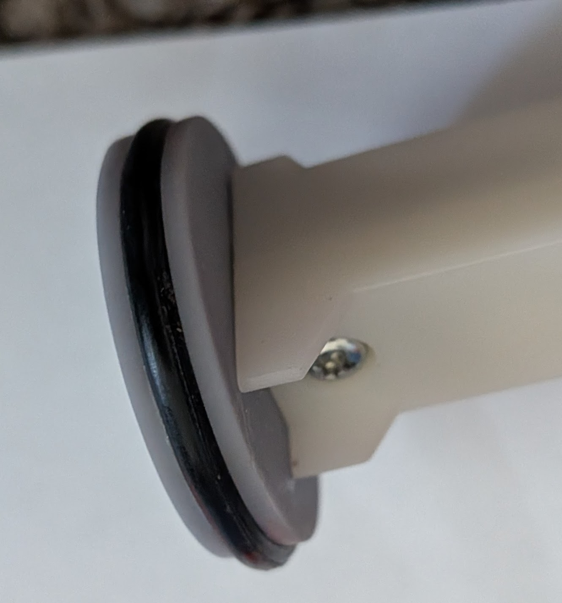

Now put the air chamber back together. The new piece goes in, then the spring
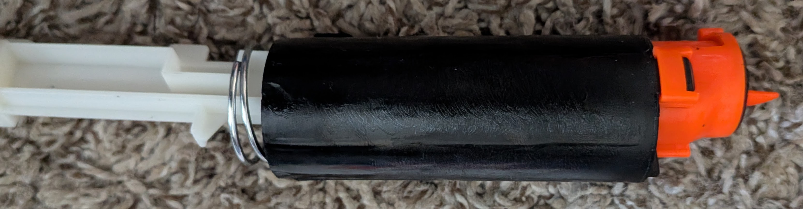

Now put the air chamber and the fixed arm back in place. Note that the spring is held against the blue plastic and the arm slides on a rail against the other white plastic arm that extends backwards.
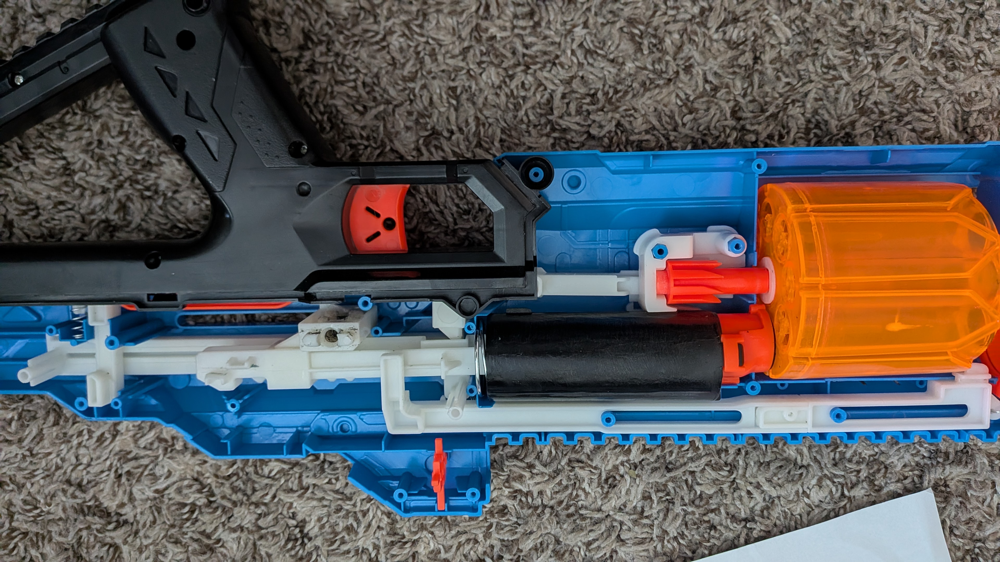

Align all the parts and screw back together all 19 screws. *DO NOT* attempt to fire the blaster while it is open. It is a spring-loaded mess and it will become a parts volcano.

Now try it. It should work again!

## Problem 2

This one is much easier to solve. [This part](cocking_mechanism_final.stl) which is defined in [this Python code](cocking_mechanism.py) replaces the orange plastic holder that surround the metal pin.

To get it working, you first need to remove the pin from the orange plastic. It is glued on, so you will probably have to break the plastic that is attached to the pin (carefully!) or dissolve it in acetone.

Once the metal pin is free, use plastic safe model glue, epoxy, or similar to glue the pin into the hole in the part. Wait until it is fully dry. 

Then, screw the part in as a drop in replacement for the old one.